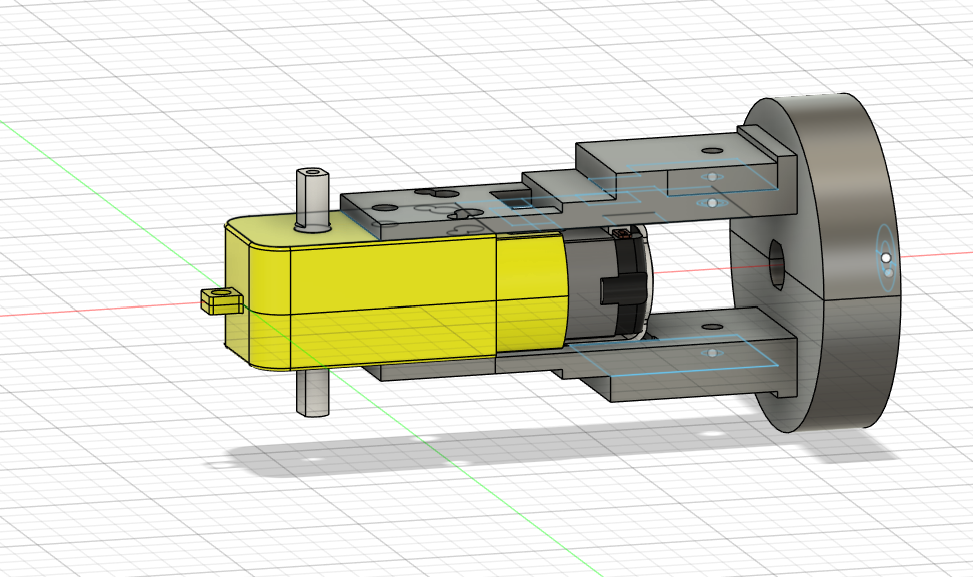
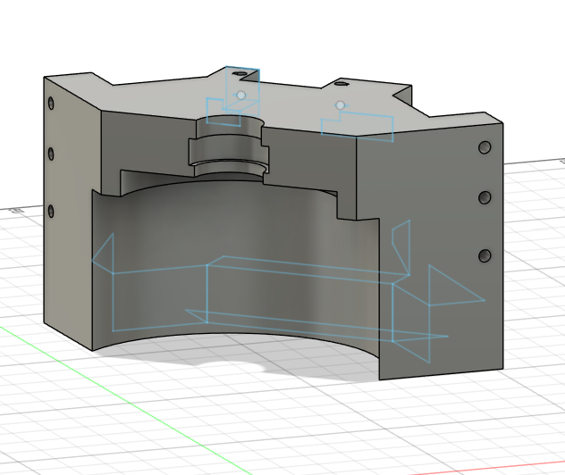
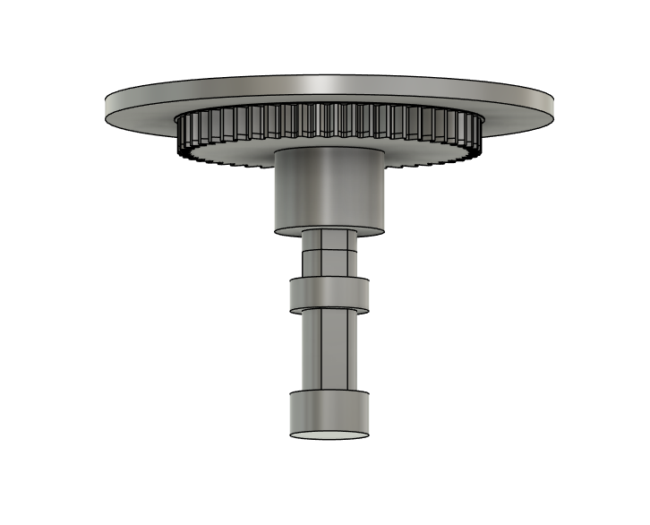
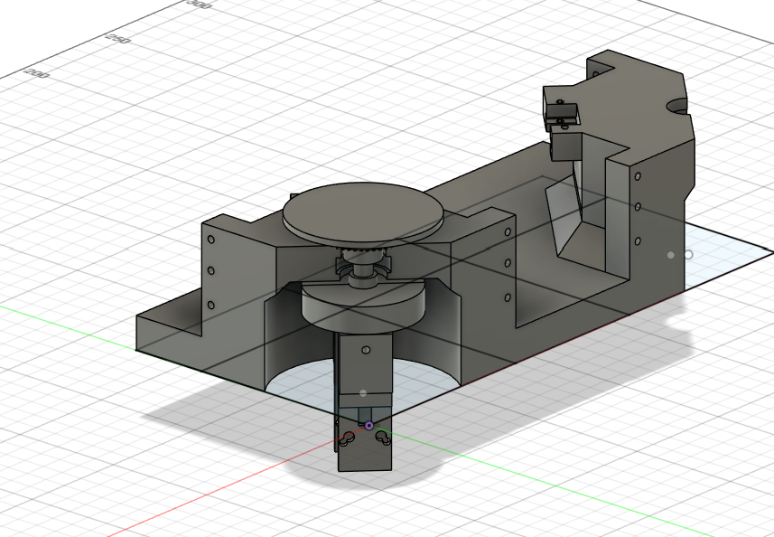
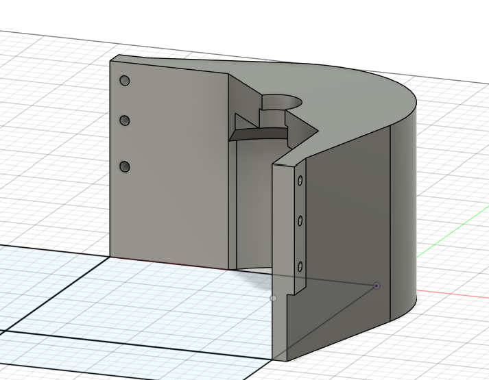
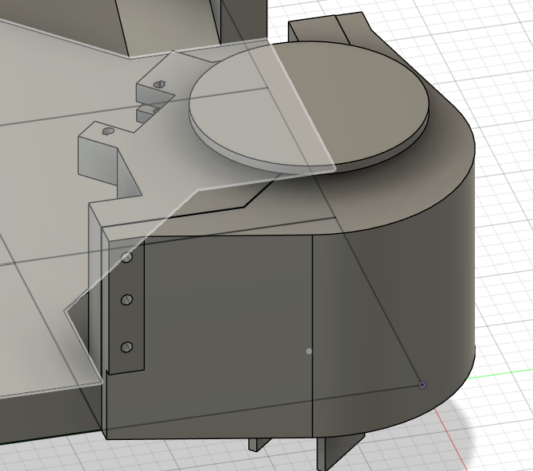
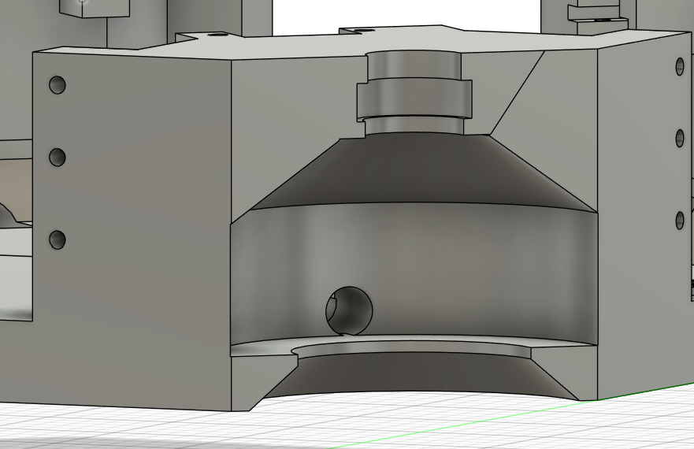
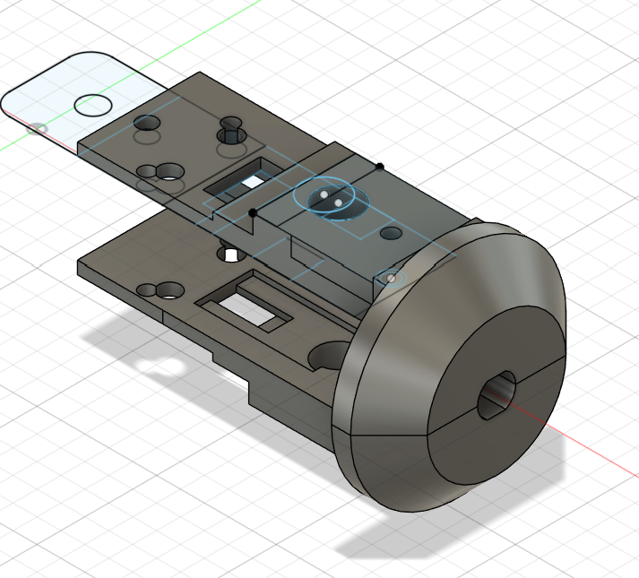
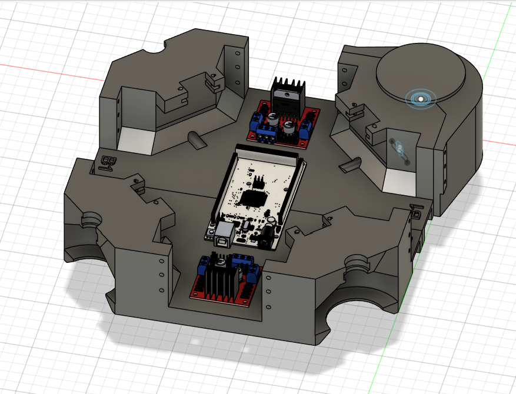

# May 18th: Started project.

I've been looking into FRC a lot lately, and I love how their robots move.
I learned that it has something to do with "swerve drive" so I think I want to make a custom 3D printed chassis which runs it.

I will probably design using Fusion 360. I have limited experience with CAD, but that is the one I've used the most (so like twice), therefore it is what I will use for this project.

My processor will be an Arduino (at the moment I'm not sure which one but leaning towards Mega 2560), and I'm going to try to use as basic components as I can because of the limited budget

Time spent: 30mins

# May 19th: Created the Motor Hook!

Based around a standard DC yellow 3-6V arduino motor, I made a model which should ideally be able to rotate controlled directly by a Nema 17 stepper motor

The model in the image is laying on it's side, and will be vertical with the DC motor at the bottom.

The one thing I'm worried about is the plastic on plastic nature of the model, and I will probably need to fix that later. This is useful for proportions though.

Time spent: 3 hrs

# May 22th: Created a design for the corners
I forgot to Journal my last two days of work and I forget what I did where so I will just put everything here.

I did some research and long-term plastic on plastic would mean that the Nema 17 could start missing steps, so I moved to a bearing-based design.
This model will be on all four corners of the car, so that the wheels are equidistant from the two corners connected to it.

The current design for the Motor Hook still holds, I just added a connector piece to attach it to the bearing
It fits with the bearing, corner piece, and Motor hook, and should hold them all together.

Time spent: 4hrs

# May 23: Start body design

Friday!!
I had a free night tonight so I spent wayy to long working on this. ( It's like 3am why am I still up)

Firstly: I took the corner piece and turned it into a half.
 - The car base is 25cm by 25cm, and the widest 3D printer I can get access to is 21cm by 26cm, therefore I am doing a half

Then I created an attachement to help keep the motor hook and bearing in the bot

Time spent: 6hrs

# May 24: Redesign part of all corner pieces / motor hook

Phew! Good thing It's a weekend.

While working on this project I came across the 45 degree rule, which basically comprises of: Don't 3D print overhangs more than 45 degrees. It won't end well for you.

I then looked at my project, and: Voila! So many 90 degree overhangs.

Since the frame I am working on is going to be completely 3D printed, that is a problem that I needed to fix.

So first I fixed the corners by making 45 degree overhang:

Then, to stop intersects with the corner I fixed the motor hook

Finally, now That I had a working design, I duplicated the half to create a full body (And imported some models to get screwholes for l298n motor driver and Arduino Mega)

In summary all I did was make my objects slightly more 3D printer compatible. But man did that take a long time.

Time spent: ~9 hrs

# May 25